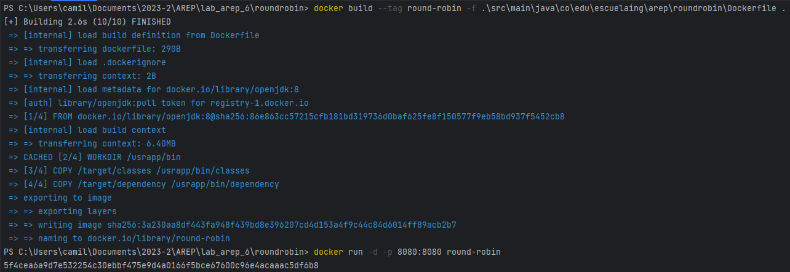
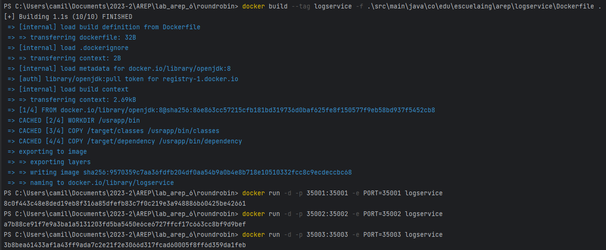
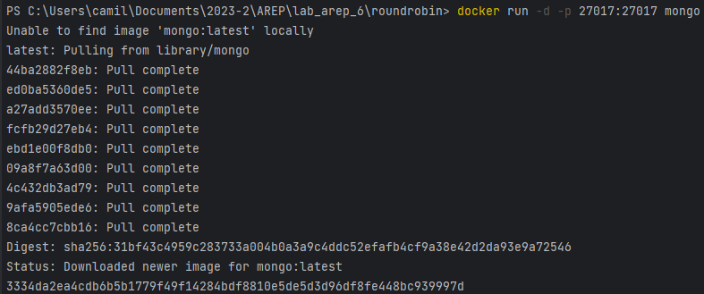
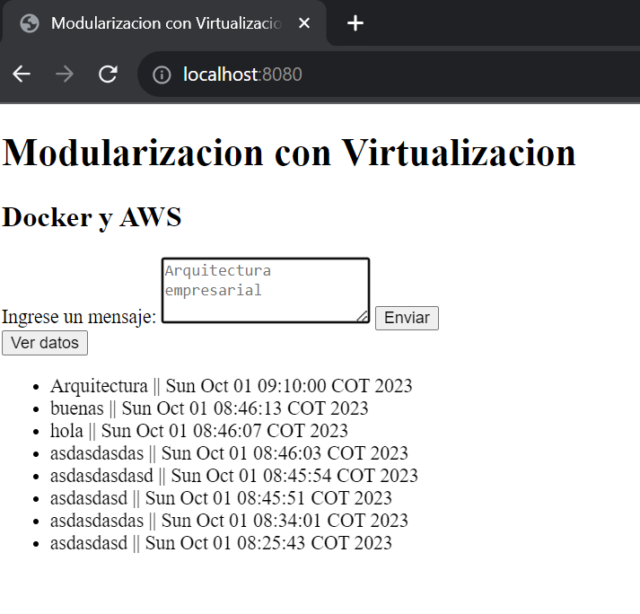
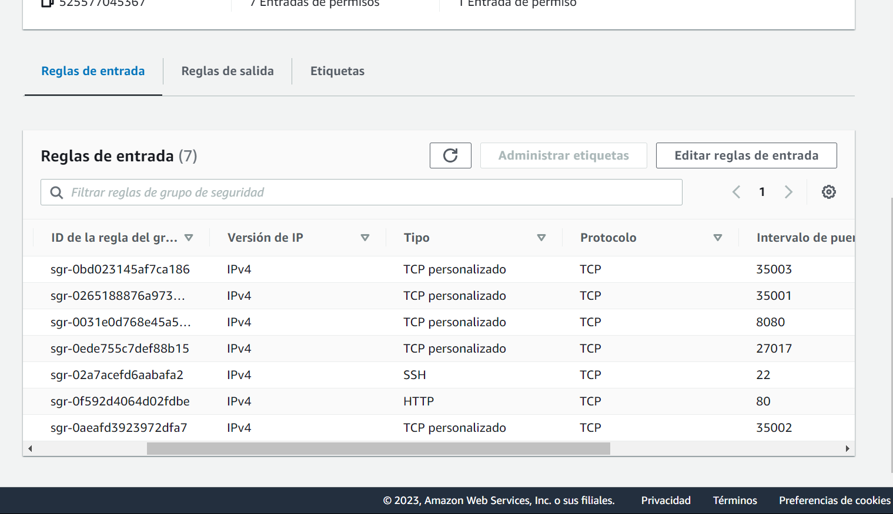
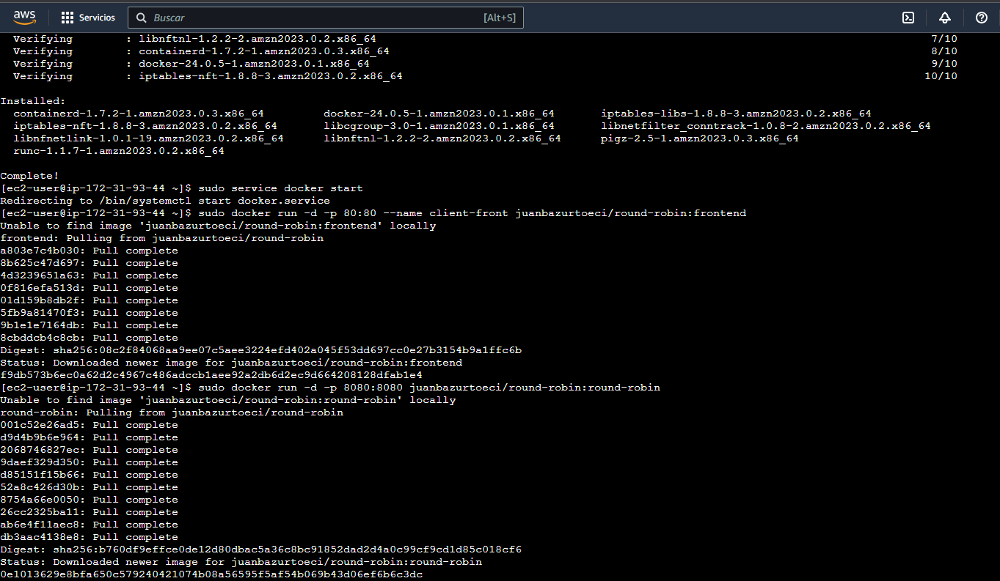
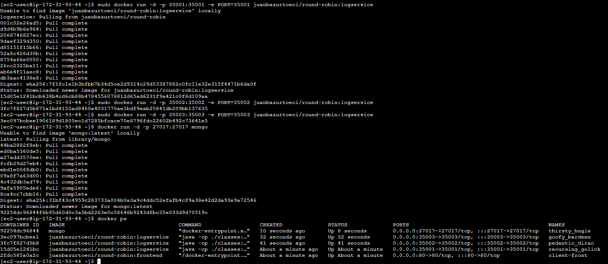

# PATRONES ARQUITECTURALES

## Getting Started

Estas instrucciones te ayudarán a obtener una copia del proyecto en funcionamiento en tu máquina local para desarrollo y pruebas. Consulta la sección de "Despliegue" para obtener notas sobre cómo implementar el proyecto en un sistema en vivo.

### Prerequisites

Cosas que necesitas instalar y cómo hacerlo.

- [Java Development Kit (JDK)](https://www.oracle.com/java/technologies/javase-jdk11-downloads.html)
- [Maven](https://maven.apache.org/install.html)
- [DockerDesktop](https://www.docker.com/products/docker-desktop/)

### Installing

Sigue estos pasos para configurar tu entorno de desarrollo:

1. Clona el repositorio:

   ```bash
   https://github.com/juan-bazurto-eci/lab_arep_6
2. Navega al directorio del proyecto

    ```
   cd lab_arep_6
   ```

3. Hacemos la construccion del proyecto

   ```
   mvn package
   ```

## Deployment

Ejecutamos los siguientes comandos

    mvn clean package install
    mvn clean install

Corremos el servidor (localhost)

#### Frontend

Situarce en la carpeta static

     cd .\src\main\resources\static\
     docker build --tag frontend .
     docker run -d -p 80:80 --name client-front frontend

#### Round Robin

    docker build --tag round-robin -f .\src\main\java\co\edu\escuelaing\arep\roundrobin\Dockerfile .
    docker run -d -p 8080:8080 round-robin



#### Log Service

    docker build --tag logservice -f .\src\main\java\co\edu\escuelaing\arep\logservice\Dockerfile .
    docker run -d -p 35001:35001 -e PORT=35001 logservice
    docker run -d -p 35002:35002 -e PORT=35002 logservice
    docker run -d -p 35003:35003 -e PORT=35003 logservice



#### Mongo DB

    docker run -d -p 27017:27017 mongo:3.6.1



### Se debe tener en cuenta que el proyecto está configurado para correr en EC2


## Running the tests

El servidor responde a todas las funciones



## AWS

Configuramos EC2 para el proyecto

Configuramos las reglas



Lanzamos docker y en los respectivos puertos corremos las imagenes de DockerHub





## Built With
* [Java](https://www.java.com/) - Lenguaje de programación principal
* [Maven](https://maven.apache.org/) - Gestión de dependencias y construcción del proyecto
* Git - Control de versiones
* [DockerHub](https://hub.docker.com/)
* [SparkJava](https://sparkjava.com/)
* HTML, JavaScript - Interfaz de usuario

## Authors

* **Juan Camilo Bazurto** - [Linkedin](https://www.linkedin.com/in/juan-camilo-b-b65379105/) - [GitHub](https://github.com/juan-bazurto-eci)